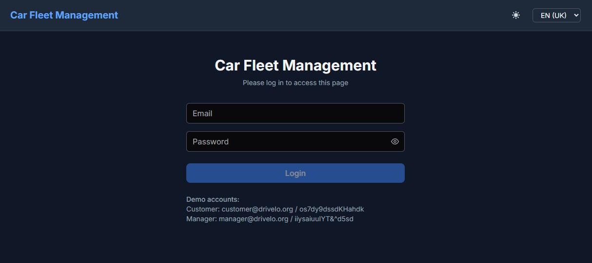
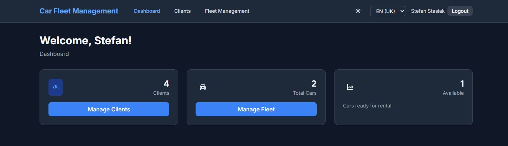
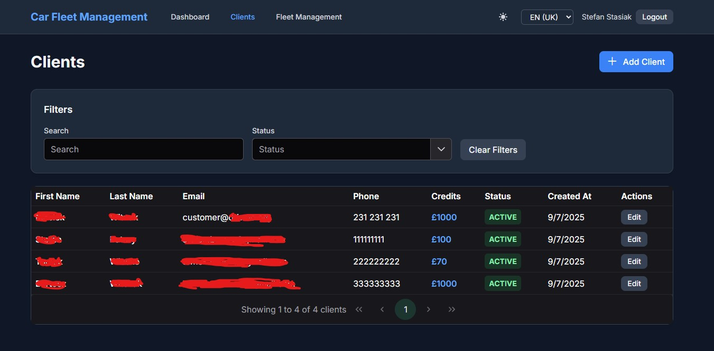
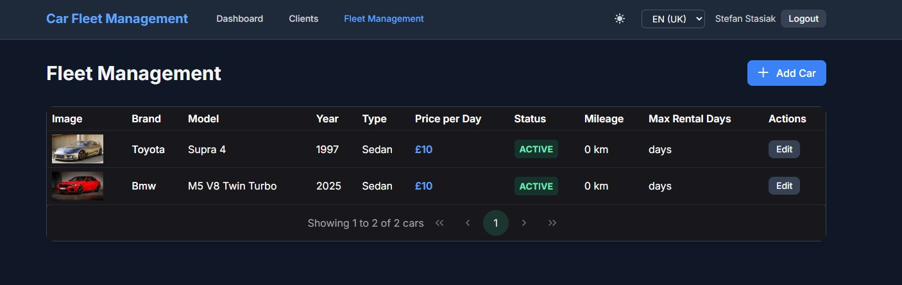
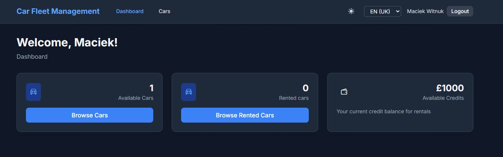
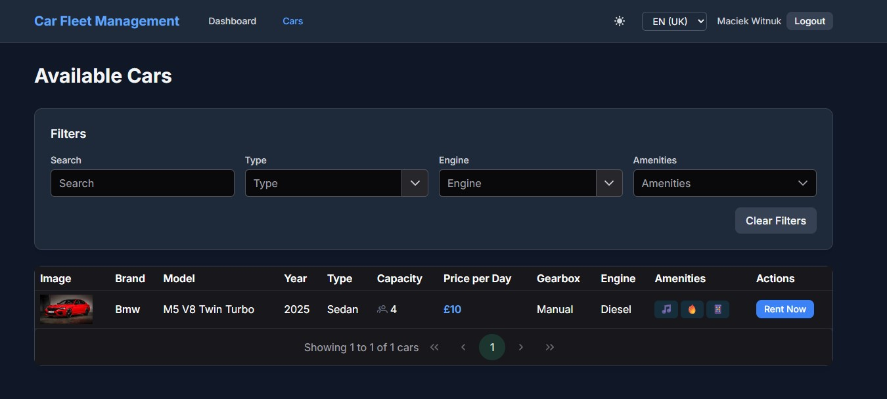
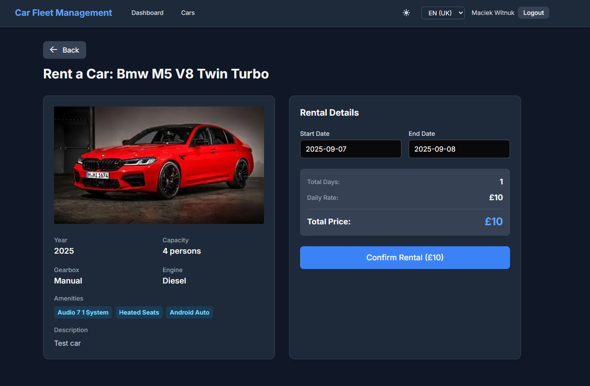

# Car Fleet App "Drivelo"

## ℹ️ About app

**Drivelo Car Fleet App** is a simple car rental app that allows you to rent cars and manage them.
It is built upon a simple SPA frontend and REST API backend.

## ✨ Features preview

#### Login Screen

#### Manager's Dashboard Screen

#### Customers management Screen

#### Cars management Screen

#### Customer's Dashboard Screen

#### Cars for renting Screen

#### Car renting Screen

### 🎭 Actors

You can log in as a manager to administrate a car fleet or a customer to rent a car.

What can do in depth each role?
* Admin - Basically everything.
* Manager
    * Can add new cars.
    * Can add new customers.
    * Can view all cars.
    * Can view all customers.
    * Can edit customer details.
* Customer
    * Can rent a car.
    * Can view available cars.
    * Can view rented cars.

## 📚 Tech stack

### Backend

* Java 21 (last LTS, 25 will be released soon :)
* Spring Boot
* Spring Security
* Spring Data JPA
* Spring Web
* Spring Validation
* Spring Boot DevTools
* Spring Boot Test

### Frontend

* Angular 20.2.4
* primeng 20.1.1
* zod 3.24.3
* tailwinds 4.1.12
* @ngx-translate/core 17.0.0
* @ngrx/signals 20.0.1
* jest 30.1.3
* jest-environment-jsdom 30.1.2
* jest-preset-angular 15.0.0
* ts-node 10.9.2
* Typescript 5.8.3

## 🖥️ Environment

🚀 How to run the app in the dev mode?

* Create application-dev.properties in the ./src/main/resources/ directory.
* Run `COMPOSE_PROFILES=db docker compose up` or `task start-dev-db` to start a database.
* Visit frontend directory, then run `npm run start`
* Install everything with `mvn clean install`
* Run `mvn spring-boot:run -Dspring-boot.run.profiles=dev` to start backend

## ❗ Disclaimer ❗

All email addresses, phone numbers, and domains shown in screenshots, UI examples, or sample data within this project are for demonstration purposes only.
These are not intended to represent real contact information and should not be used for actual communication.
For best practice, please use reserved demo domains like example.com or clearly fictional data in your own implementations.